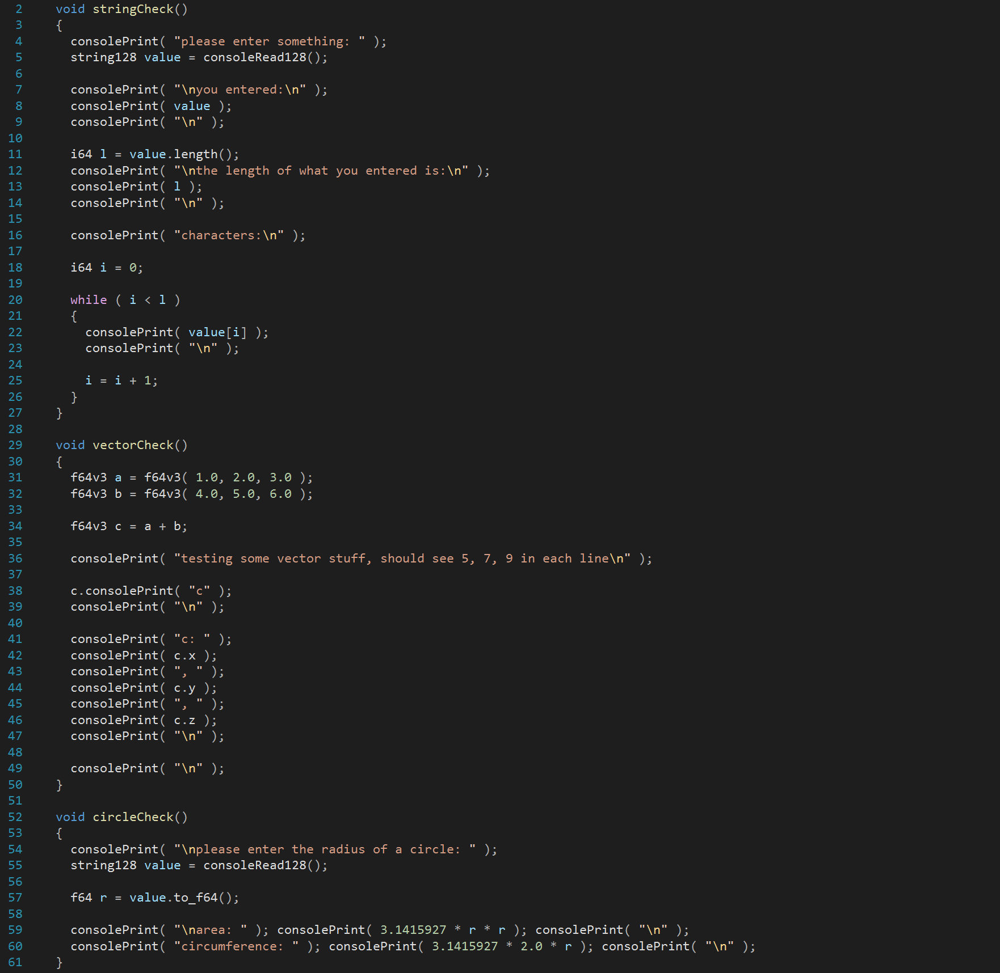

# Perpetual Crunch

A simple script compiler and VM in one easy to use command line tool.

The code is all in C++, flex, and bison. It was tested with Visual Studio 2022.  You can find the 
Visual Studio sln file under NativeWin/PerpetualCrunch.

After building the solution in Release, you'll get an executable under the NativeWin/PerpetualCrunch/x64/Release folder.  
The executable is called PerpetualCrunch.exe.

To get help info from the command line you can type:

<pre>

  PerpetualCrunch -h

</pre>

To run the sample script:

<pre>

  PerpetualCrunch -r ../../samples/sample.crunch

</pre>

The Perpetual Crunch language is a c-like language.  The built-in types are:

<pre>

  string      : a string of characters, a literal string is surrounded by quotes, eg. 'Hello, World!'
  char        : a single character, a literal char is surrounded by single quotes, eg. 'a'
  i64         : a 64 bit wide signed integer
  u64         : a 64 bit wide unsigned integer
  f64         : a 64 bit wide float
  bool        : a 64 bit wide signed integer internally, can be assigned the literal values of true or false, which are represented internally by 1 and 0

</pre>

Please see the sample script, sample.crunch for a working example of the language.
